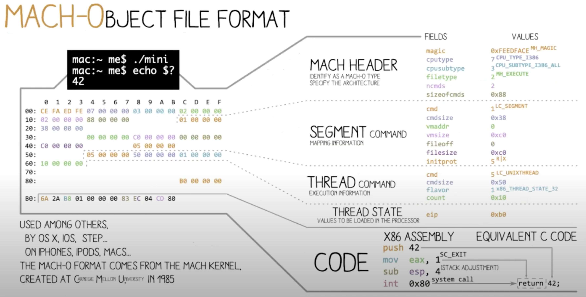

# Binary architecture analysis: nm & otool commands

[source](https://www.youtube.com/watch?v=RInasZ0IwMA)
## nm command

*nm* displays the name list (symbol table of nlist structures) of each object file in
       the argument list.  In some cases, as with an object that has had strip(1) with its
       -T option used on the object, that can be different from the dyld information.  For
       that content, use dyldinfo(1).

## otool command
